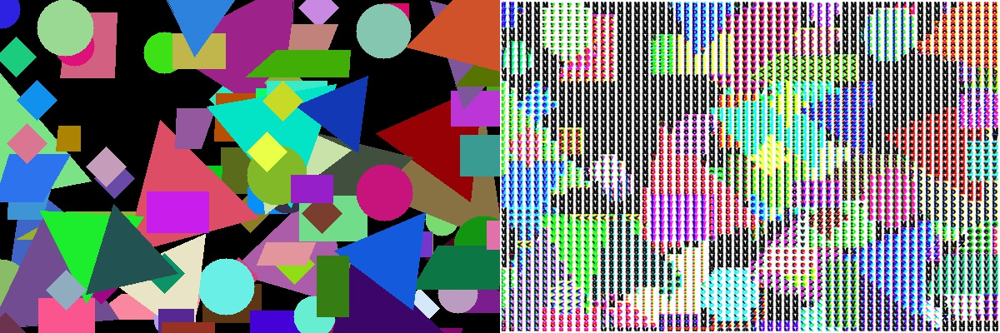

# ASCII-Art
Convert image, video, camera data stream to ASCII art

将图像，视频，相机数据流转换为ASCII图像

###Method 方法 1：

Convert each channel of a color image into an ASCII image separately, and then merge the three channels so that the color information can be preserved.

将彩色图片的每个通道分别转换为ASCII图像，然后合并三个通道，这样可以保留彩色信息

